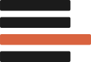

# Badness 

**Badness** is a language server, formatter, and linter for LaTeX.

It parses LaTeX into a **lossless concrete syntax tree** and builds three tools
on top of it:

- a **formatter** (`badness format`) that lays out source deterministically,
- a **linter** (`badness lint`) that reports diagnostics, and
- a **language server** (`badness lsp`) that brings both to your editor, as well
  as many other features.

The architecture follows [rust-analyzer](https://rust-analyzer.github.io/): a
generic, error-tolerant, hand-written parser produces a lossless tree, semantics
are layered on top as a separate concern, and recomputation is incremental.

## The Architecture

Badness treats input as generic TeX surface syntax. It never *requires*
resolving macros or catcodes to succeeddoing that in full generality is
equivalent to running a TeX engine, so anything it cannot statically recognize
degrades to generic nodes rather than a crash. Two properties are guaranteed by
construction and enforced as test oracles:

- **Losslessness**: the parsed tree reconstructs the input byte-for-byte.
- **Idempotence**: formatting an already-formatted file changes nothing.

## Where to Go Next

- [Installation](guide/installation.md): get the `badness` binary.
- [Getting Started](guide/getting-started.md): format and lint your first file.
- [Editor Setup](guide/editor-setup.md): wire up the language server.
